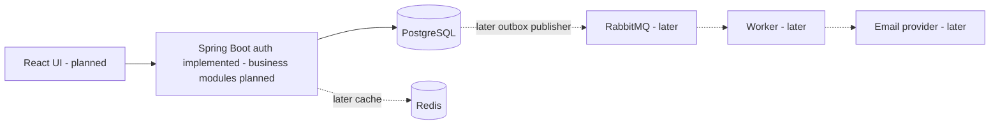

# GateFlow

Configurable approval workflows with reliable execution and traceable decisions.

> **Status: Milestone 3 — authentication backend implemented and verified.**
> Signup/login/logout/CSRF/current-user APIs work. Organization RBAC, workflow
> execution, frontend, queues, and production deployment are not implemented yet.

## Problem

Purchase, software-access, and policy-exception approvals often disappear into
email and chat. Organizations need enforceable review rules, clear ownership,
and a reliable record of decisions.

## Solution

GateFlow will bind each submitted request to a published workflow version,
activate eligible review steps, enforce authorized state transitions, and record
the outcome. It approves requests; it does not execute payments or provision access.

## Features

**Implemented:** repository/architecture, fourteen core + two auth tables, four
Flyway migrations, ER/index/transaction docs, Spring Boot authentication, BCrypt,
hashed opaque sessions, CSRF/secure-cookie handling, shared auth rate limiting,
validation/errors/request IDs, unit/HTTP/database tests, and local build/run tooling.

**Planned:** tenant-scoped API authorization, RBAC, versioned sequential approvals,
reviewer inbox, search, notification preferences, durable background delivery,
audit records, and concurrency-safe transitions. Parallel approvals and SLA
escalation follow a working sequential workflow. See [milestones](docs/milestones.md).

## Architecture

Start with a modular monolith. Domain modules own their rules; controllers adapt
HTTP requests; persistence and provider adapters remain outside domain logic.
A separate worker deployment from the same codebase is a later scaling option.



See [system design](docs/architecture/system-design.md).

## Tech Stack

| Technology | Purpose | Current status |
| --- | --- | --- |
| Java 21, Spring Boot 3.5.16, Maven | Backend runtime and build | Authentication backend implemented |
| Spring Security | Session authentication, CSRF, authenticated endpoint gate | Implemented; product RBAC is M4 |
| JPA/Hibernate, JDBC, PostgreSQL 17 | Identity persistence, atomic session/limiter SQL, relational integrity | Implemented core/auth schema |
| Flyway OSS 13.8.1 | Explicit schema migrations | Implemented via digest-pinned tools container |
| Redis | Measured cache use and shared rate limits | Milestone 7 |
| RabbitMQ | Durable background jobs | Milestone 8 |
| React, TypeScript, Vite | Authenticated application UI | Milestone 14 |
| JUnit, Mockito, Testcontainers | Unit and real HTTP/database verification | 34 Java tests plus 59 DB checks passed |
| Docker Compose, GitHub Actions | Local dependencies and CI | Dependency Compose now; CI later |

Exact application dependency versions will be selected and pinned when the build
is introduced. No release compatibility or vulnerability claim is made yet.

## System Design

[Components, flows, capacity assumptions, reliability, scaling](docs/architecture/system-design.md).
[Decisions](docs/decisions/README.md) explain alternatives and trade-offs.

## Database Design

[Schema and entity relationships](docs/database/schema.md),
[ER diagram](docs/database/er-diagram.md), [indexes](docs/database/indexes.md),
[transaction boundaries](docs/database/transactions.md), and
[Flyway operations](docs/database/migrations.md). Production will not use automatic
ORM schema creation. Authentication storage is implemented, but application
workflow behavior is not.

## API Documentation

[Authentication API](docs/api/authentication.md) documents the implemented slice:
signup, login, logout, CSRF bootstrap, and current user. Errors use sanitized
ProblemDetail responses and request IDs. Product commands (submit/approve/reject/
withdraw) and organization RBAC remain planned. Full OpenAPI review is Milestone 12.

## Local Development

Prerequisites: Git, Docker/Compose v2, Python 3, Java 21 and Maven 3.8+.
The agent built and verified this milestone; the commands below are reproducibility
documentation, not a requirement for the user to execute it locally.

```sh
cp .env.example .env
# Edit .env: replace the local PostgreSQL password placeholder.
bash scripts/check.sh
bash scripts/dev-db.sh up
bash scripts/dev-db.sh status
bash scripts/migrate-db.sh migrate
bash scripts/migrate-db.sh validate
bash scripts/test-backend.sh
python3 scripts/run-backend.py --jar
```

The start command rejects the unchanged password placeholder. Alternatively,
after configuring `.env`, run `docker compose up -d --wait` directly. At this
milestone Compose starts **only PostgreSQL** unless tools are requested; the
Spring Boot backend is run separately by the development launcher. Full app
containerization remains Milestone 16.

See [development instructions](docs/development.md) for stopping, resets, and
troubleshooting. Never reuse local credentials in production.

## Testing

`bash scripts/check.sh` verifies the scaffold and shell syntax and, when Docker is
available, validates Compose without printing its resolved secrets. It does not
exercise business logic or database connectivity.

Run `bash scripts/test-db.sh` for real database integration verification: fresh
migrations, validation, repeat-migrate no-op, SQL integrity assertions, checksum
rejection, failed-migration rollback/revalidation, and automatic disposable-database
cleanup. Application/security and
multi-connection concurrency tests will accompany their features; Milestone 13
expands them.

Real PostgreSQL runtime verification has also passed in the agent's Linux sandbox:
healthy startup, SQL smoke query, host TCP password authentication, wrong-password
rejection, and persistence across container recreation. No user-side setup was
needed. Actual results and limitations:
[Milestone 1 verification](docs/verification/milestone-1.md) and
[Milestone 2 verification](docs/verification/milestone-2.md).

`bash scripts/test-backend.sh` runs Maven verify: 15 unit + 19 real HTTP/PostgreSQL
tests, with no Docker-silent skips, and packages the executable JAR. Ten additional
packaged-application smoke checks passed. See
[Milestone 3 evidence](docs/verification/milestone-3.md).

## Docker

Local PostgreSQL uses persistent storage, a readiness health check, and a
loopback-only host port. PostgreSQL and Flyway are pinned to tested image digests;
updates require explicit review and migration tests. Flyway is a one-shot tools
profile, not a long-running application. Application Dockerfiles and a full local
stack are intentionally deferred. Production image scanning is still future work.

## CI/CD

No workflow is active yet. Planned pipeline: build, lint, unit tests, integration
tests, container build, and security checks. Production deployment needs an
explicit rollout/rollback plan and approval; it is not enabled automatically.

## Performance

No benchmarks have been run. Capacity figures in system design are planning
assumptions, not measured throughput. Milestone 19 records before/after results.

## Security

Local `.env` is ignored. Passwords use BCrypt cost 12; random session tokens are
stored only as hashes. Secure-mode cookies use __Host prefixes; CSRF is required
for auth writes. Shared limits fail closed on storage errors. DTOs/errors/logs avoid
credential disclosure. Tenant/resource RBAC, email verification/recovery, runtime
DB least privilege, ingress hardening, and dependency review are unfinished.
**This is not production-deployment-ready.** See [session decision](docs/decisions/005-cookie-sessions.md).

## Trade-offs

A modular monolith favors understandable transactions and low operational cost
over premature service boundaries. PostgreSQL search comes before a separate
search cluster. RabbitMQ serves background delivery; Kafka is not required for
our initial workload. See [architecture decisions](docs/decisions/README.md).

## Future Improvements

Parallel approval quorums, reminder/escalation policies, delegation, provider
adapters, and independent worker scaling—only after the core is verified.

## Screenshots

Not available: the UI is not implemented.

## Demo

No hosted demo exists. The agent started the packaged authentication backend
and verified its live lifecycle against PostgreSQL. There is no browser UI yet.

## Engineering Challenges

Versioned workflows; tenant-safe queries; approve/withdraw races; duplicate
submission; database-to-queue consistency; idempotent workers; and avoiding
stale authorization caches. These are planned work, not completed capabilities.

## Contributing and License

Follow [contributing guidance](CONTRIBUTING.md). Licensed under [MIT](LICENSE).
Implementation-level responsibilities are in [LLD](docs/architecture/lld.md).
