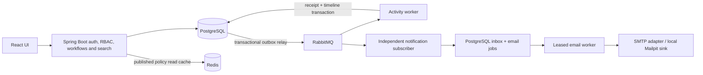

# GateFlow

Configurable approval workflows with reliable execution and traceable decisions.

> **Status: backend foundation and repository hardening implemented; production release remains gated.**
> Core backend behavior remains covered by the existing 313-test baseline. The React UI, production dependency audit, container image builds, full Docker stack, health/metrics contract, and k6 smoke workload passed on a GitHub-hosted Docker runner. No AWS production deployment was performed; the hosted demo is not production certification.

## Current hardening review

[PR #25](https://github.com/sagarbagwe/gateflow/pull/25) was merged by the maintainer
into `main` at `c5753c878ee8953a732783be2ef59375e895063a`.
The extended full-stack CI and corrected Java/TypeScript CodeQL matrix are installed.
The final PR checks passed; merged-main CodeQL passed and backend/frontend CI jobs passed.
Merged-main full-stack CI also passed; see
[post-merge verification](docs/verification/post-merge-release.md) for exact runs and live probes.
[Hardening evidence](docs/verification/hardening.md) distinguishes measured engineering
results from production/operator gates. The hosted login page is reachable, but the
Railway backend aggregate health reports **503 / DOWN**. Frontend/backend deployed
commit identity and authenticated read-only demo navigation passed with corrected credentials; live business
write flows and deployed commit identity remain unverified. This is not
production certification.
## Problem

Purchase, software-access, and policy-exception approvals often disappear into
email and chat. Organizations need enforceable review rules, clear ownership,
and a reliable record of decisions.

## Solution

GateFlow binds each submitted request to a published workflow version,
activates eligible review steps, enforces authorized state transitions, and records
the outcome. It approves requests; it does not execute payments or provision access.

## Features

**Implemented:** repository/architecture, twenty-four application tables, eleven
Flyway migrations, ER/index/transaction docs, Spring Boot authentication, BCrypt,
hashed opaque sessions, CSRF/secure-cookie handling, shared auth rate limiting,
validation/errors/request IDs, organization RBAC with safe delegation, protected
admin membership, version guards, atomic security audits, unit/HTTP/database/race
tests, versioned conditional workflows, concurrency-safe decisions/withdrawal,
durable idempotency receipts, reviewer reassignment, tenant-safe full-text search,
active reviewer inbox, status/type/workflow/date filters, bounded cursor/offset
navigation, additive upgrade checks, published-policy Redis cache-aside with expiry/
invalidation/outage fallback, bounded authenticated Redis infrastructure, transactional
request outbox, confirmed RabbitMQ publication, idempotent activity projection,
manual acknowledgments, delayed retries, dead-letter recovery, recipient-scoped
notification inbox/read states/preferences, independent event subscribers, durable
SMTP jobs/attempt history, safe retry/unknown-outcome quarantine, protected audit
metadata/detail browsing, bounded evidence, and local build/run tooling.

**Planned:** verified-address production provider setup,
controlled audit retention tooling, and broader workflow policies. Parallel approvals and SLA
escalation follow a working sequential workflow. See [milestones](docs/milestones.md).

## Architecture

Start with a modular monolith. Domain modules own their rules; controllers adapt
HTTP requests; persistence and provider adapters remain outside domain logic.
The relay and activity worker run in the monolith; independent role flags permit
worker deployments from the same artifact as a later scaling option.



See [system design](docs/architecture/system-design.md).

## Tech Stack

| Technology                                     | Purpose                                                                 | Current status                                                  |
| ---------------------------------------------- | ----------------------------------------------------------------------- | --------------------------------------------------------------- |
| Java 21, Spring Boot 3.5.16, Maven             | Backend runtime and build                                               | Authentication, RBAC and workflow implemented                   |
| Spring Security                                | Session authentication, CSRF, authenticated endpoint gate               | Implemented with tenant and request-specific policies           |
| JPA/Hibernate, JDBC, PostgreSQL 17             | Relational identity/policy, transactional commands and durable receipts | Implemented core/auth schema                                    |
| Flyway OSS 13.8.1                              | Explicit schema migrations                                              | Implemented via digest-pinned tools container                   |
| Redis 7.4.11, Spring Data Redis/Lettuce        | Published-policy read cache only; auth rate limits remain PostgreSQL    | Milestone 7 implemented                                         |
| RabbitMQ 4.2.9, Spring AMQP                    | Independent activity/notification subscribers, confirms/retries/DLQs    | Implemented                                                     |
| Spring Mail/Jakarta Mail, local Mailpit 1.31.3 | SMTP provider adapter and safe local capture                            | M9 implemented; no external mailbox contacted                   |
| React 19, TypeScript, Vite                     | Responsive authentication, request, inbox and notification UI           | Implemented                                                     |
| JUnit, Mockito, Testcontainers                 | Unit and real HTTP/database verification                                | Unit, HTTP/database, and RBAC race tests; evidence linked below |
| Docker Compose, GitHub Actions                 | Full local stack and CI                                                 | Implemented; production deploy intentionally disabled           |

Build dependency versions are pinned by the POM/Boot dependency management.
No comprehensive vulnerability or production-capacity claim is made yet.

## System Design

[Components, flows, capacity assumptions, reliability, scaling](docs/architecture/system-design.md).
[Decisions](docs/decisions/README.md) explain alternatives and trade-offs.

## Database Design

[Schema and entity relationships](docs/database/schema.md),
[ER diagram](docs/database/er-diagram.md), [indexes](docs/database/indexes.md),
[transaction boundaries](docs/database/transactions.md), and
[Flyway operations](docs/database/migrations.md). Production will not use automatic
ORM schema creation. Authentication, RBAC and sequential approval behavior are
implemented; activity processing is asynchronous; parallel approvals remain future work.

## API Documentation

[Authentication API](docs/api/authentication.md) documents the implemented slice:
signup, login, logout, CSRF bootstrap, and current user. Errors use sanitized
ProblemDetail responses and request IDs. Product commands (submit/approve/reject/
withdraw/reassign) are implemented in [Core workflow API](docs/api/workflows.md).
[RBAC API](docs/api/rbac.md) documents organization/role/membership commands.
[Search API](docs/api/search.md) documents request summaries, reviewer inbox,
filter semantics and cursor consistency/security limits.
[Activity API](docs/api/activity.md) documents the eventually consistent request timeline.
[Notification API](docs/api/notifications.md) documents private inbox/count/read/preferences;
[email delivery contract](docs/notifications/delivery.md) explains retries and SMTP uncertainty.
OpenAPI is implemented and disabled by default; enable it only for authenticated internal use.

## Local Development

Prerequisites: Git, Docker/Compose v2, Python 3, Java 21 and Maven 3.8+.
The agent built and verified this milestone; the commands below are reproducibility
documentation, not a requirement for the user to execute it locally.

```sh
cp .env.example .env
# Edit .env: replace PostgreSQL, Redis and RabbitMQ password placeholders.
bash scripts/check.sh
docker compose up -d --wait
bash scripts/dev-db.sh status
bash scripts/migrate-db.sh migrate
bash scripts/migrate-db.sh validate
bash scripts/test-backend.sh
python3 scripts/run-backend.py --jar
```

The development launcher rejects unchanged password placeholders. Compose requires
configured values but does not enforce password strength; use distinct private secrets.
Compose starts the frontend, backend, PostgreSQL, cache-only Redis, RabbitMQ, and local-only Mailpit. Use `bash scripts/test-stack.sh` on a Docker host for the readiness and same-origin API smoke checks.

See [development instructions](docs/development.md) for stopping, resets, and
troubleshooting. Never reuse local credentials in production.

## Testing

`bash scripts/check.sh` verifies the scaffold and shell syntax and, when Docker is
available, validates Compose without printing its resolved secrets. It does not
exercise business logic or database connectivity.

Run `bash scripts/test-db.sh` for real database integration verification: fresh
migrations, validation, repeat-migrate no-op, SQL integrity assertions, checksum
rejection, failed-migration rollback/revalidation, and automatic disposable-database
cleanup. Application/security and multi-connection RBAC/workflow race tests are now
implemented; historical Milestone 13 evidence records critical-workflow coverage.

Real PostgreSQL runtime verification has also passed in the agent's Linux sandbox:
healthy startup, SQL smoke query, host TCP password authentication, wrong-password
rejection, and persistence across container recreation. No user-side setup was
needed. Actual results and limitations:
[Milestone 1 verification](docs/verification/milestone-1.md) and
[Milestone 2 verification](docs/verification/milestone-2.md).

M12 full Maven verify passes **313 tests** (119 unit, 182 real HTTP/dependency tests,
seven PostgreSQL upgrade/index cases, five SMTP adapter checks), zero failures/errors/
skips, and packages the executable JAR. Seven controlled concurrency races also
passed three further fresh-container runs (**21 additional executions**).
M10 database integrity passes **128 checks**; final packaged app passes **100 assertions**.
See [Milestone 11 evidence](docs/verification/milestone-11.md) and
[Milestone 10 audit evidence](docs/verification/milestone-10.md).
Earlier Redis verification remains in [Milestone 7 evidence](docs/verification/milestone-7.md).
Earlier [search](docs/verification/milestone-6.md),
[core workflow](docs/verification/milestone-5.md),
[RBAC](docs/verification/milestone-4.md) and
[authentication](docs/verification/milestone-3.md) evidence remains historical.

## Docker

Local PostgreSQL and RabbitMQ use persistent storage; Redis is a reconstructible
128-MiB allkeys-lru cache with no disk persistence. All use readiness checks and
authenticated loopback-only host ports. Redis runs unprivileged/read-only with
dropped capabilities and private tmpfs config. PostgreSQL, Redis, RabbitMQ and Flyway use
tested image digests;
updates require explicit review and migration tests. Mailpit is a digest-pinned,
unprivileged/read-only, bounded ephemeral mail capture sink with no relay configured.
Flyway is a one-shot tools
profile, not a long-running application. A one-node broker is not highly available.
Backend/frontend Dockerfiles and the full local stack are implemented. The installed CI starts an isolated Compose environment and exercises an authenticated approval lifecycle, real-browser navigation, runtime-role restrictions, restore and application-image/source-secret gates. Backend/frontend application image scans passed for the reviewed runtime artifact. Infrastructure advisories and periodic rescanning remain release requirements.

## CI/CD

GitHub Actions builds and tests the backend and frontend, builds both container images, uploads the JAR, and runs CodeQL. Dependabot covers Maven, npm, Actions, and Docker. Production deployment remains intentionally disabled pending explicit approval and environment controls.

## Performance

Seeded PostgreSQL EXPLAIN (ANALYZE, BUFFERS) checks verify rare-term GIN search
and B-tree feed/deep-cursor index selection on 30,002 records across two tenants
after normal bulk-load vacuum maintenance. These are structural plan checks,
not production latency/load benchmarks. Capacity figures remain assumptions.
The current [authenticated workload](docs/performance/hardening-workload.md) records raw measurements and limitations. No new optimization speedup is claimed. Redis hits omit the
ordered policy-step query, not current authorization/header SQL; no percentage
speedup is claimed. See [cache contract](docs/cache/workflow-policy.md).

## Security

Local `.env` is ignored. Passwords use BCrypt cost 12; random session tokens are
stored only as hashes. Secure-mode cookies use __Host prefixes; CSRF is required
for all auth, RBAC and workflow writes. Auth rate limits fail closed on storage
errors. DTOs/errors/logs avoid
credential disclosure. Redis failure never bypasses authorization; display caches
do not drive approval execution. Live tenant/resource RBAC, delegation ceilings, last-admin
protection, and security audit writes are implemented. Request-specific ownership/assignment
rules and bounded bodies are implemented. Notifications require recipient ownership
and current request visibility; email preflight rechecks opt-in/access/stale action.
Messages contain only a generic sign-in reminder, never business details. External
production email must remain disabled until verified-address/abuse/provider setup.
Runtime DB least privilege is implemented and verified on the isolated stack; actual production credential rollout is unverified. Email verification/recovery, production ingress/IAM, infrastructure advisory review and operational release gates remain unfinished.
**This is not production-deployment-ready.** See [session decision](docs/decisions/005-cookie-sessions.md).

## Trade-offs

A modular monolith favors understandable transactions and low operational cost
over premature service boundaries. PostgreSQL search comes before a separate
search cluster. RabbitMQ serves background delivery; Kafka is not required for
our initial workload. Delivery is at least once, with a deduplicated database
projection—not exactly-once messaging or external email. Timeline reads can lag
committed state. Queue bounds do not solve long-term outbox retention. SMTP acceptance and a
PostgreSQL finish commit cannot be atomic: unknown sends/expired external leases
are quarantined, not blindly resent; Message-ID is not provider idempotency.
See [delivery and recovery contract](docs/async/event-delivery.md) and
[architecture decisions](docs/decisions/README.md).

## Future Improvements

Parallel approval quorums, reminder/escalation policies, delegation, provider
adapters, and independent worker scaling—only after the core is verified.

## Frontend

The responsive SPA implements signup/login, organization selection, request search, reviewer inbox, notifications, loading/error/empty states, keyboard focus, reduced-motion handling, and same-origin cookie/CSRF transport. See `frontend/README.md`.

## Demo

[GateFlow hosted demo](https://gateflow-jade.vercel.app/). Public login/signup screens
and same-origin CSRF/protected API responses were observed during the audit. This
is not a claim that every authenticated production flow, deployment revision,
cloud recovery objective, or production email provider has been verified.

## Engineering Challenges

Implemented challenges: tenant-safe admin queries, safe permission delegation,
immediate privilege revocation, atomic audit rollback, concurrent last-admin
protection, immutable policy binding, approve/withdraw races, duplicate commands,
shared detail/list visibility, tied-time pagination and fresh cursor authorization.
Implemented challenges: atomic outbox, independent deduplicated consumers,
recipient/access drift, preference version races, cache fallback, and SMTP acceptance
with a failed database marker. Terminal email reconciliation, verified-address
provider setup, retention, recovery drills and representative measured load remain release work; basic observability is implemented.

## Contributing and License

Follow [contributing guidance](CONTRIBUTING.md). Licensed under [MIT](LICENSE).
Implementation-level responsibilities are in [LLD](docs/architecture/lld.md).

Milestone 4 verification: [RBAC evidence and limitations](docs/verification/milestone-4.md).

Milestone 5 verification: [Core workflow evidence and limitations](docs/verification/milestone-5.md).

Milestone 6 verification: [Search evidence and limitations](docs/verification/milestone-6.md).

Milestone 7 verification: [Redis evidence and limitations](docs/verification/milestone-7.md).

## Audit investigation

See [API](docs/api/audit.md), [evidence/trust boundary](docs/audit/evidence.md)
and [Milestone 10 verification](docs/verification/milestone-10.md).

## Concurrency correctness

Seven observed PostgreSQL lock-barrier races verify single business winners and
atomic decision/audit/outbox/receipt effects. No redundant distributed locks or
performance claims. See [consistency contract](docs/concurrency/consistency.md)
and [Milestone 11 verification](docs/verification/milestone-11.md).

## API contract and Swagger

[Conventions](docs/api/conventions.md), [Swagger setup](docs/api/openapi.md) and
[generated specification](docs/api/openapi.json). Documentation is disabled by default
and session-protected when enabled.

## Verification strategy

[Testing strategy](docs/testing/strategy.md); packaged API E2E is reproducible with
`bash scripts/test-e2e.sh`. JaCoCo reports are generated during Maven verify.

## Production readiness deliverables

- [Observability signals and runbook](docs/observability/runbook.md)
- [AWS architecture, recovery, cost, and rollout](docs/aws/architecture.md)
- [Performance baseline and acceptance gates](docs/performance/baseline.md)
- [Security threat review and release checklist](docs/security/review.md)

## Audit remediation and interview preparation

[Changes and verification limits](docs/verification/audit-remediation.md),
[production release blockers](docs/security/release-gates.md), and
[interview explanations](docs/interview/README.md).
Frontend now includes bounded request/inbox/notification navigation, explicit search
filters, notification read/preferences controls, versioned role/member management,
sequential policy draft editing/publication, request activity/reassignment and
read-only audit browsing. Existing-version inspection still requires a version UUID;
there is no backend version-directory endpoint. Signup is not email verification.
