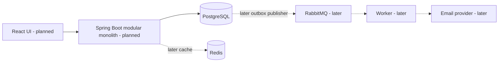

# GateFlow

Configurable approval workflows with reliable execution and traceable decisions.

> **Status: Milestone 1 — repository and architecture scaffold.** No application,
> authentication, migrations, REST endpoints, or frontend has been implemented.
> The only runnable service currently configured is local PostgreSQL.

## Problem

Purchase, software-access, and policy-exception approvals often disappear into
email and chat. Organizations need enforceable review rules, clear ownership,
and a reliable record of decisions.

## Solution

GateFlow will bind each submitted request to a published workflow version,
activate eligible review steps, enforce authorized state transitions, and record
the outcome. It approves requests; it does not execute payments or provision access.

## Features

**Implemented:** repository scaffold, architecture/decision documentation,
local PostgreSQL Compose configuration, scaffold verification, Git conventions.

**Planned:** tenant isolation, authentication, RBAC, versioned sequential approvals,
reviewer inbox, search, notification preferences, durable background delivery,
audit records, and concurrency-safe transitions. Parallel approvals and SLA
escalation follow a working sequential workflow. See [milestones](docs/milestones.md).

## Architecture

Start with a modular monolith. Domain modules own their rules; controllers adapt
HTTP requests; persistence and provider adapters remain outside domain logic.
A separate worker deployment from the same codebase is a later scaling option.



See [system design](docs/architecture/system-design.md).

## Tech Stack

| Technology | Purpose | Current status |
| --- | --- | --- |
| Java 21, Spring Boot, Maven | Backend runtime and build | Planned; no application yet |
| Spring Security | Authentication and authorization | Planned |
| JPA/Hibernate, PostgreSQL 17 | Relational persistence | PostgreSQL local configuration only |
| Flyway | Explicit schema migrations | Milestone 2 |
| Redis | Measured cache use and shared rate limits | Milestone 7 |
| RabbitMQ | Durable background jobs | Milestone 8 |
| React, TypeScript, Vite | Authenticated application UI | Milestone 14 |
| JUnit, Mockito, Testcontainers | Unit and integration verification | Added with relevant features |
| Docker Compose, GitHub Actions | Local dependencies and CI | Dependency Compose now; CI later |

Exact application dependency versions will be selected and pinned when the build
is introduced. No release compatibility or vulnerability claim is made yet.

## System Design

[Components, flows, capacity assumptions, reliability, scaling](docs/architecture/system-design.md).
[Decisions](docs/decisions/README.md) explain alternatives and trade-offs.

## Database Design

Design starts in Milestone 2: tenant boundaries, workflow definitions versus
execution instances, constraints, indexes, ER diagram, and Flyway migrations.
Production will not use automatic ORM schema creation.

## API Documentation

No API exists yet. Planned commands include submit, approve, reject, and withdraw,
not merely CRUD. Error handling, validation, request IDs, and authorization will
arrive with the first endpoints; full OpenAPI review is Milestone 12.

## Local Development

Prerequisites for this milestone: Git, Docker Engine/Desktop with Compose v2,
and Python 3 for the lightweight scaffold checker. No Java build is needed yet.

```sh
cp .env.example .env
# Edit .env: replace the local PostgreSQL password placeholder.
./scripts/check.sh
./scripts/dev-db.sh up
./scripts/dev-db.sh status
./scripts/dev-db.sh logs
```

The start command rejects the unchanged password placeholder. Alternatively,
after configuring `.env`, run `docker compose up -d --wait` directly. At this
milestone it starts **only PostgreSQL**, not GateFlow.

See [development instructions](docs/development.md) for stopping, resets, and
troubleshooting. Never reuse local credentials in production.

## Testing

`./scripts/check.sh` verifies the scaffold and shell syntax and, when Docker is
available, validates Compose without printing its resolved secrets. It does not
exercise business logic or database connectivity. Unit, integration, security,
and concurrency tests will accompany their features; Milestone 13 expands them.

Actual results and limitations: [Milestone 1 verification](docs/verification/milestone-1.md).

## Docker

Local PostgreSQL uses persistent storage, a readiness health check, and a
loopback-only host port. `postgres:17-bookworm` follows PostgreSQL 17 patch
releases; it is not a reproducible digest pin. Application Dockerfiles and a full
local stack are intentionally deferred. Production images will be pinned and scanned.

## CI/CD

No workflow is active yet. Planned pipeline: build, lint, unit tests, integration
tests, container build, and security checks. Production deployment needs an
explicit rollout/rollback plan and approval; it is not enabled automatically.

## Performance

No benchmarks have been run. Capacity figures in system design are planning
assumptions, not measured throughput. Milestone 19 records before/after results.

## Security

Local `.env` files are ignored by Git. Tenant isolation, secure authentication,
resource-specific authorization, bounded input, and sensitive-data redaction are
required design invariants. This scaffold is **not deployment-ready**.

## Trade-offs

A modular monolith favors understandable transactions and low operational cost
over premature service boundaries. PostgreSQL search comes before a separate
search cluster. RabbitMQ serves background delivery; Kafka is not required for
our initial workload. See [architecture decisions](docs/decisions/README.md).

## Future Improvements

Parallel approval quorums, reminder/escalation policies, delegation, provider
adapters, and independent worker scaling—only after the core is verified.

## Screenshots

Not available: the UI is not implemented.

## Demo

No hosted demo exists. Current local setup runs the database dependency only.

## Engineering Challenges

Versioned workflows; tenant-safe queries; approve/withdraw races; duplicate
submission; database-to-queue consistency; idempotent workers; and avoiding
stale authorization caches. These are planned work, not completed capabilities.

## Contributing and License

Follow [contributing guidance](CONTRIBUTING.md). Licensed under [MIT](LICENSE).
