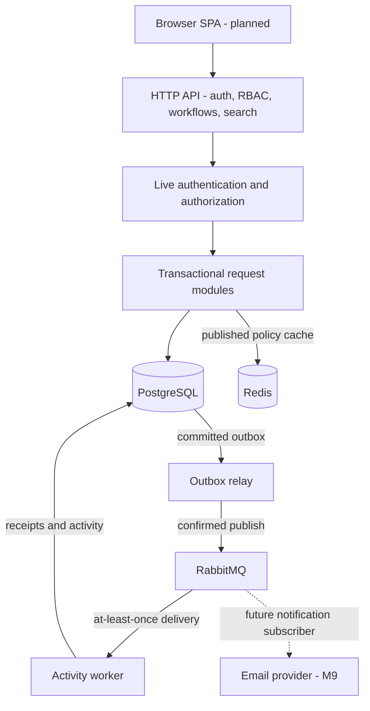
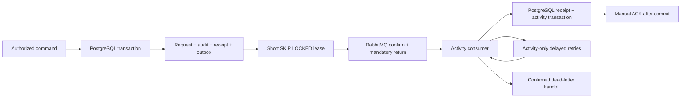

# System design

Status: Milestones 1–8 implemented: authentication, organization RBAC, sequential
workflows, search, bounded policy cache and durable asynchronous activity. Nine
Flyway migrations / 20 application tables. Frontend, notifications, full metrics,
CI and production deployment remain later milestones. Older future-flow sketches
below describe eventual notification processing, not an implemented email provider.

Implemented storage model: [schema](../database/schema.md),
[ER diagram](../database/er-diagram.md), [indexes](../database/indexes.md), and
[transaction boundaries](../database/transactions.md).

## Functional requirements

1. Organizations manage membership and organization-scoped roles/permissions.
2. Administrators publish immutable workflow versions.
3. Members submit requests against a published version.
4. Eligible reviewers approve/reject active steps; invalid transitions fail.
5. Requesters see status and may withdraw where the lifecycle allows it.
6. Users search only requests they are authorized to see.
7. Decisions generate atomic audit evidence and asynchronous activity; notifications follow in M9.
8. Later: parallel review, deadlines, reminders, and escalation.

## Non-functional requirements

- Correct state and tenant isolation take priority over availability shortcuts.
- Short transactions and bounded list endpoints; no unbounded exports initially.
- Business outcomes survive application restarts.
- Background delivery tolerates retries and duplicate messages.
- Secrets and personal data must not appear in logs.
- Reproducible migrations and meaningful integration tests before deployment.
- Availability and latency SLOs require a deployment and measurements; none are claimed.

## Domain boundaries

| Module | Owns | Boundary rule |
| --- | --- | --- |
| Identity and membership | Users, organizations, memberships | Membership belongs to an organization |
| Authorization | Roles, permissions, policy checks | Permission plus resource eligibility, default deny |
| Workflow definitions | Drafts, immutable published versions | No mutation of versions referenced by active requests |
| Request execution | Instances, active steps, decisions | Owns lifecycle transitions and transaction boundary |
| Notifications | Preferences, inbox, delivery attempts | Cannot modify approval outcomes |
| Audit | Decision/action evidence | No normal API updates or deletes |

The backend is one Spring Boot deployment with module boundaries, not six network
services. Logical table ownership discourages cross-module repository access;
application services coordinate operations requiring one database transaction.
The planned UI is a React/TypeScript SPA. Activity runs in the monolith today;
independent worker deployment can use the same codebase.

## Components and external systems

- **HTTP API:** authenticates, validates, authorizes, dispatches commands/queries.
- **PostgreSQL:** authoritative business state and relational constraints.
- **Redis:** bounded cache of published definitions only; rate limits remain PostgreSQL.
- **Outbox relay:** publishes committed request references using fenced leases/confirms.
- **RabbitMQ:** durable activity quorum queues, retries and dead-letter routing.
- **Activity worker:** deduplicated PostgreSQL timeline; notification worker remains M9.
- **Email adapter (later):** provider-specific integration behind an interface.
- **Observability (incremental):** request IDs/basic logs first; metrics and traces later.

No external identity provider, payment gateway, or provisioning API is required
for the first product. A development email sink precedes any live email provider.

## Request flow: approve an active step

1. Authenticate the principal. Resolve organization from authorized membership,
   not merely a client-supplied tenant identifier.
2. Validate input and resolve idempotency requirements.
3. Load a tenant-scoped request. Check permission, reviewer assignment, active
   step, and lifecycle state inside the command's consistency boundary.
4. Atomically record the decision and update step/request state. An expected
   version/conditional update detects conflicting state changes.
5. Record corresponding audit evidence and an outbox event in the
   **same database transaction** as the request and command receipt.
6. Commit and return the updated state. Do not call email providers in the transaction.

Final concurrency policy and constraints are specified with the schema and core
workflow. Early workflow correctness will not wait until Milestone 11.

## Asynchronous flow (Milestones 8–9)

1. Business state and outbox event commit together.
2. Relay claims one event at a time in a bounded poll and confirms persistent routing.
3. Mark published only after broker confirmation. A crash after publish but before
   marking may cause a duplicate; this is expected.
4. Consumer uses event identity and durable unique constraints to deduplicate
   database effects; it acknowledges only after those effects commit.
5. Producer retries use capped exponential backoff with jitter; consumer retries
   use three fixed delay queues. Invalid references and exhausted processing go to DLQ.
6. External email sends cannot be atomically committed with PostgreSQL. Use a
   stable provider idempotency key when supported; otherwise document the residual
   duplicate-send window and reconcile delivery attempts. Do not promise exactly once.

Outbox leases, retry limits and reference schema are implemented in M8. Redrive
remains a documented operator action, not a public endpoint. Email remains M9.

## Lifecycle and workflow-version invariants

- Request state and step state are different concepts.
- Published versions are immutable; drafts are editable.
- Every submitted request references exactly one workflow version.
- Only active, assigned, eligible reviewers may decide.
- Reject/withdraw/final approval are mutually exclusive terminal outcomes.
- Decisions have unique identities; constraints prevent duplicate reviewer decisions.
- Define self-approval rules explicitly before implementing the core workflow.

## Capacity estimation — illustrative assumptions, not benchmarks

| Input | Assumption |
| --- | --- |
| Organizations | 100 |
| Daily active users per organization | 100 |
| Total DAU | 10,000 |
| API requests per DAU/day | 80 |
| API requests/day | 800,000 |
| Average over 24 hours | 800,000 / 86,400 ≈ 9.3 requests/second |
| 10x average peak planning factor | Approximately 93 requests/second |
| New business requests/day | 5,000 |
| Retention example | 365 days |

Peak factor is a simplifying assumption; office-hour concentration can change it.

Storage worksheet (decimal units):
- Requests: 5,000 × 365 × 2 KB ≈ 3.65 GB/year.
- Decisions: four/request × 1 KB ≈ 7.30 GB/year.
- Audit events: six/request × 1 KB ≈ 10.95 GB/year.
- Base rows ≈ 21.90 GB/year; a provisional 2–3x envelope for indexes/row overhead
  gives 43.8–65.7 GB. This is not a measured database size and excludes notification
  history, outbox backlog, users/definitions, WAL, backups, and future attachments.
- Definition cache: 10,000 entries × 8 KB ≈ 80 MB payload; provision additional
  space for Redis overhead after measuring cardinality; rate-limit storage remains PostgreSQL.

Refine using actual serialized sizes, index sizes, retention, and load tests.
Do not derive a supported-user claim from this worksheet.

## Database choice

PostgreSQL supports transactional decisions, referential integrity, uniqueness,
and indexed tenant-scoped queries. JSONB may store a narrowly validated condition
payload, not replace relational identifiers and constraints. Start search with
PostgreSQL indexes/full-text features; no separate search cluster is justified yet.

Use Flyway. Production Hibernate configuration validates schema; it does not
create or update it. Tenant-sensitive relations need constraints preventing a
request from linking to another organization's workflow or member. The implemented composite keys and storage guards are documented in
the database design; fresh tenant/resource read authorization is implemented.
Backups and point-in-time recovery require a deployment plan.

## Caching (implemented in M7)

Cache immutable published workflow definitions by tenant, definition, and version.
TTL, bounds and eviction are documented in the M7 contract below. Cache-aside falls
back to PostgreSQL on cache errors. Publishing creates a new version/key rather
than silently modifying an old entry. Permission checks remain authoritative;
cache revocation semantics must be designed before caching authorization.

Rate-limit outage behavior differs from content caching: sensitive auth endpoints
must not silently lose abuse protection. Choose and test a bounded fallback or
explicit rejection policy. Current PostgreSQL auth rate limiting fails closed.

## Scaling strategy

1. Inspect query plans, eliminate N+1 loading, and add justified indexes.
2. Vertically size PostgreSQL and maintain bounded connection pools.
3. Horizontally scale stateless API instances behind a load balancer.
4. Scale workers independently when backlog/processing latency warrants it.
5. Add tenant quotas and fair processing to reduce noisy-neighbor effects.
6. Consider read replicas only for stale-tolerant reads. Approval commands and
   authorization-sensitive reads use the primary.
7. Partition/archive audit data only after measuring growth and access patterns.

Implemented M3 sessions are PostgreSQL-backed and restored per request, so
replicas do not depend on in-memory/servlet sessions. Shared rate counters use
atomic DB upserts. No Kubernetes, sharding, or microservices are required now.

## Reliability and failure behavior

| Failure | Intended behavior |
| --- | --- |
| PostgreSQL unavailable | State-changing request fails; never invent success |
| Redis cache unavailable | Definition reads fall back; rate-limit policy is separate |
| Broker unavailable | Committed outbox waits; alert on age/backlog growth |
| Publisher crashes after send | Duplicate event is deduplicated by consumer |
| Consumer crashes | Unacknowledged work is redelivered |
| Email timeout | Record ambiguous attempt; retry according to provider guarantees |
| Concurrent approval/withdrawal | One valid transition wins; loser receives conflict |

Bound database/provider timeouts. Retry only safe/idempotent operations. Introduce
circuit breakers for unreliable external providers where failure evidence warrants
one; not around every local method. Monitor dead letters and provide reviewed
replay procedures rather than automatic endless replays.

## Observability

Structured logs with request/trace IDs, tenant ID where appropriate, operation,
outcome, and duration; redact credentials, tokens, and sensitive request payloads.
Planned metrics: request count/latency/error rate, DB query latency, pool saturation,
outbox oldest age, queue backlog, delivery failures, cache hit rate, and transition
conflicts. Avoid user/request IDs as metric labels due to cardinality.
Readiness and liveness have different purposes; optional email failure must not
make the API unready. Dashboards and alert thresholds follow actual baselines.

## Security and production readiness

Explicit tenant/resource authorization, secure password hashing, input bounds,
TLS at ingress, CSRF protection when cookie credentials are used, least-privilege
DB access, secrets management, non-sensitive logs, and dependency scanning are
required. Authentication uses opaque hashed database sessions; see
[ADR 005](../decisions/005-cookie-sessions.md).
Local development credentials and exposed localhost ports are not an AWS design.
Cloud service selection, restore drills, SLOs, cost estimates, and rollback strategy
follow in the cloud/security milestones before any production claim.

## Implemented M4 request/transaction flow

Cookie authentication -> validated tenant path/command -> live active membership
and permission union -> tenant-scoped resource checks -> transaction -> organization
row lock -> fresh authorization -> delegation/admin/version checks -> writes and
allowed-field audit -> commit -> response. No provider calls or background event
publish occur in this slice. Audit failure rolls back the security mutation.

Horizontal replicas share PostgreSQL locks and immediate grant lookups. All RBAC
writes for one organization serialize; different organizations can proceed
independently. This is suitable for infrequent administration, not a benchmarked
throughput claim. Future workflow throughput should use per-request concurrency
controls rather than the coarse RBAC lock. Directory pages are bounded and avoid
per-row role queries; bounded offset/keyset search is implemented in M6.

## Implemented M5 synchronous core

Publication: auth/CSRF/body bounds -> shared tenant authorization lock -> definition
and draft-version row locks -> typed role/condition validation -> immutable
publication + audit -> commit. Version ordinals and concurrency tokens differ.

Submission: auth/CSRF -> shared organization lock and live permissions -> scoped
idempotency advisory lock -> published policy/conditional steps/current assignees
-> request + execution steps + audit + receipt -> commit. Retries return that
request's current representation without repeating the operation.

Decision/withdraw/reassign: shared tenant authorization lock -> idempotency-key
lock -> request aggregate row lock -> state/version/resource/assignment eligibility
-> step/decision/request mutations + audit + receipt -> commit. No network provider
calls. M8 writes an outbox in this transaction before publishing asynchronously.

Horizontal API instances share one PostgreSQL primary, coordinating through
transaction row/advisory locks; no in-memory grant or key registry is authoritative.
Unrelated aggregates can mutate concurrently; hot aggregates serialize. Shared
organization locks briefly block exclusive RBAC mutation, not other workflow
commands. Full load/capacity/latency claims await M19 measurements.

[Core API](../api/workflows.md) and [ADR 007](../decisions/007-sequential-workflow-commands.md)
define actual success/retry/visibility and failure semantics.

## M6 implemented search path

Authenticated GET → fresh active tenant membership/grants → whitelist query parser
→ shared visibility predicates → PostgreSQL bounded summary query → sentinel and
context-bound cursor. Normal history uses organization/creation B-tree; rare token
search can use generated tsvector GIN; pending inbox joins ACTIVE assignments and
checks required role. All access filtering precedes pagination. No extra search
service, cache or background job is added.

Default cursor navigation avoids deep-offset discards for aligned indexed feeds;
offset mode is optional and capped. No total-count query, N+1 summary hydration,
arbitrary sort or unrestricted payload export. Status/type/workflow/date filters
combine with visibility and may change planner selectivity. Common search terms,
large tenant histories, historical reviewer OR predicates and rapidly changing
inboxes need production measurement before extra indexes/search infrastructure.

Creation cutoff reduces drift for later submissions, not point-in-time exports.
Per-page grants remain fresh; unsigned cursors are navigation state, never authority.
V7 backfill/index DDL needs maintenance-window planning on populated deployments.
See [API contract](../api/search.md), [ADR 008](../decisions/008-postgresql-search-keyset.md),
and [verification](../verification/milestone-6.md). Capacity assumptions elsewhere
remain assumptions; this milestone does not substantiate production throughput.

## M7 implemented cache path

Only the authorized published-version GET uses Redis for the ordered policy body.
Fresh PostgreSQL membership/grants, active definition and version header precede
lookup. Read-only policy DTOs are typed, scoped, size-limited JSON. Database commands,
auth sessions/limiter, RBAC, request states and search remain PostgreSQL-backed.
New publication uses a new immutable key; drafts bypass and rollbacks cannot warm.

Dedicated cache-only Redis has loopback-authenticated local access, 128 MiB
allkeys-lru eviction, no disk persistence, atomic expiry with jitter, short client
timeouts, disconnected-command rejection and per-process cooldown/fallback. Losing
Redis does not lose product data or grant access; PostgreSQL load rises. In-flight
misses can fill redundantly and recovery is not a distributed single-probe breaker.
Future replicas can share keys; advanced topology/TLS/ACL/managed service choices
are deployment work, not achieved by a local Compose container.

See [cache contract](../cache/workflow-policy.md), [ADR](../decisions/009-published-policy-cache.md)
and [evidence](../verification/milestone-7.md). This removes ordered-step hydration
on hits, not all source queries. No measured production latency/scalability claim.

## Implemented M8 async flow and scaling

Start relay and worker in the monolith. Independent role flags permit horizontal
worker/relay deployment from the same artifact; competing DB leases and unique
consumer receipts prevent conflicting side effects. At-least-once delivery and
out-of-order arrivals are explicit, not solved by pretending a single FIFO queue
is a global ordered log. PostgreSQL remains authoritative when the broker is down.
One-node local quorum is not HA; production service selection is deferred to M18.
No production throughput claim is derived from correctness/repeat tests.

[Full configuration, backpressure, failure recovery, security and retention limits](../async/event-delivery.md).
