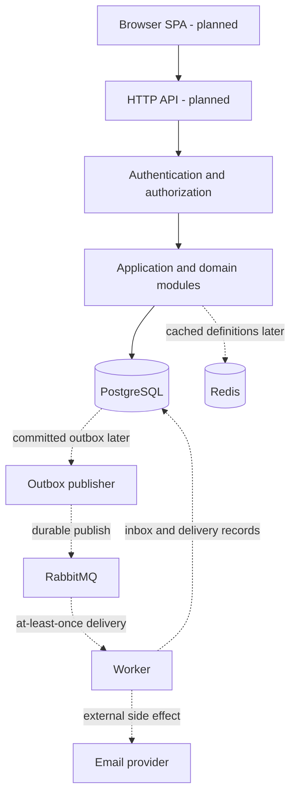

# System design

Status: proposed architecture, Milestone 1. Only the repository scaffold and
PostgreSQL dependency configuration exist. Dashed/future components are not built.

## Functional requirements

1. Organizations manage membership and organization-scoped roles/permissions.
2. Administrators publish immutable workflow versions.
3. Members submit requests against a published version.
4. Eligible reviewers approve/reject active steps; invalid transitions fail.
5. Requesters see status and may withdraw where the lifecycle allows it.
6. Users search only requests they are authorized to see.
7. Decisions generate audit evidence and asynchronous notifications.
8. Later: parallel review, deadlines, reminders, and escalation.

## Non-functional requirements

- Correct state and tenant isolation take priority over availability shortcuts.
- Short transactions and bounded list endpoints; no unbounded exports initially.
- Business outcomes survive application restarts.
- Background delivery tolerates retries and duplicate messages.
- Secrets and personal data must not appear in logs.
- Reproducible migrations and meaningful integration tests before deployment.
- Availability and latency SLOs require a deployment and measurements; none are claimed.

## Domain boundaries

| Module | Owns | Boundary rule |
| --- | --- | --- |
| Identity and membership | Users, organizations, memberships | Membership belongs to an organization |
| Authorization | Roles, permissions, policy checks | Permission plus resource eligibility, default deny |
| Workflow definitions | Drafts, immutable published versions | No mutation of versions referenced by active requests |
| Request execution | Instances, active steps, decisions | Owns lifecycle transitions and transaction boundary |
| Notifications | Preferences, inbox, delivery attempts | Cannot modify approval outcomes |
| Audit | Decision/action evidence | No normal API updates or deletes |

The backend is one Spring Boot deployment with module boundaries, not six network
services. Logical table ownership discourages cross-module repository access;
application services coordinate operations requiring one database transaction.
The UI is a React/TypeScript SPA. A worker can later run from the same codebase.

## Components and external systems

- **HTTP API:** authenticates, validates, authorizes, dispatches commands/queries.
- **PostgreSQL:** authoritative business state and relational constraints.
- **Redis (later):** cache of published definitions and shared rate limits;
  never the authoritative approval record.
- **Outbox publisher (later):** moves committed events to RabbitMQ.
- **RabbitMQ (later):** background jobs with acknowledgments and dead-letter routing.
- **Worker (later):** notification processing, bounded retries, eventual reminders.
- **Email adapter (later):** provider-specific integration behind an interface.
- **Observability (incremental):** request IDs/basic logs first; metrics and traces later.

No external identity provider, payment gateway, or provisioning API is required
for the first product. A development email sink precedes any live email provider.

## Request flow: approve an active step

1. Authenticate the principal. Resolve organization from authorized membership,
   not merely a client-supplied tenant identifier.
2. Validate input and resolve idempotency requirements.
3. Load a tenant-scoped request. Check permission, reviewer assignment, active
   step, and lifecycle state inside the command's consistency boundary.
4. Atomically record the decision and update step/request state. An expected
   version/conditional update detects conflicting state changes.
5. Record corresponding audit evidence. Once asynchronous delivery is introduced,
   insert an outbox event in the **same database transaction**.
6. Commit and return the updated state. Do not call email providers in the transaction.

Final concurrency policy and constraints are specified with the schema and core
workflow. Early workflow correctness will not wait until Milestone 11.

## Asynchronous flow (Milestones 8–9)

1. Business state and outbox event commit together.
2. Publisher claims a bounded batch and sends persistent messages to a durable queue.
3. Mark published only after broker confirmation. A crash after publish but before
   marking may cause a duplicate; this is expected.
4. Consumer uses event identity and durable unique constraints to deduplicate
   database effects; it acknowledges only after those effects commit.
5. Delivery retries use capped exponential backoff with jitter. Invalid/permanent
   failures are not retried indefinitely. Exhausted work goes to a dead-letter path.
6. External email sends cannot be atomically committed with PostgreSQL. Use a
   stable provider idempotency key when supported; otherwise document the residual
   duplicate-send window and reconcile delivery attempts. Do not promise exactly once.

Outbox leases, retry limits, replay tooling, and event schemas are designed at
Milestone 8, not prebuilt now. Non-notification external effects require their own design.

## Lifecycle and workflow-version invariants

- Request state and step state are different concepts.
- Published versions are immutable; drafts are editable.
- Every submitted request references exactly one workflow version.
- Only active, assigned, eligible reviewers may decide.
- Reject/withdraw/final approval are mutually exclusive terminal outcomes.
- Decisions have unique identities; constraints prevent duplicate reviewer decisions.
- Define self-approval rules explicitly before implementing the core workflow.

## Capacity estimation — illustrative assumptions, not benchmarks

| Input | Assumption |
| --- | --- |
| Organizations | 100 |
| Daily active users per organization | 100 |
| Total DAU | 10,000 |
| API requests per DAU/day | 80 |
| API requests/day | 800,000 |
| Average over 24 hours | 800,000 / 86,400 ≈ 9.3 requests/second |
| 10x average peak planning factor | Approximately 93 requests/second |
| New business requests/day | 5,000 |
| Retention example | 365 days |

Peak factor is a simplifying assumption; office-hour concentration can change it.

Storage worksheet (decimal units):
- Requests: 5,000 × 365 × 2 KB ≈ 3.65 GB/year.
- Decisions: four/request × 1 KB ≈ 7.30 GB/year.
- Audit events: six/request × 1 KB ≈ 10.95 GB/year.
- Base rows ≈ 21.90 GB/year; a provisional 2–3x envelope for indexes/row overhead
  gives 43.8–65.7 GB. This is not a measured database size and excludes notification
  history, outbox backlog, users/definitions, WAL, backups, and future attachments.
- Definition cache: 10,000 entries × 8 KB ≈ 80 MB payload; provision additional
  space for Redis overhead and rate-limit data after measuring cardinality.

Refine using actual serialized sizes, index sizes, retention, and load tests.
Do not derive a supported-user claim from this worksheet.

## Database choice

PostgreSQL supports transactional decisions, referential integrity, uniqueness,
and indexed tenant-scoped queries. JSONB may store a narrowly validated condition
payload, not replace relational identifiers and constraints. Start search with
PostgreSQL indexes/full-text features; no separate search cluster is justified yet.

Use Flyway. Production Hibernate configuration validates schema; it does not
create or update it. Tenant-sensitive relations need constraints preventing a
request from linking to another organization's workflow or member. Details follow
in Milestone 2. Backups and point-in-time recovery require a deployment plan.

## Caching (later)

Cache immutable published workflow definitions by tenant, definition, and version.
TTL and memory eviction will be documented when implemented. Cache-aside falls
back to PostgreSQL on cache errors. Publishing creates a new version/key rather
than silently modifying an old entry. Permission checks remain authoritative;
cache revocation semantics must be designed before caching authorization.

Rate-limit outage behavior differs from content caching: sensitive auth endpoints
must not silently lose abuse protection. Choose and test a bounded fallback or
explicit rejection policy during implementation.

## Scaling strategy

1. Inspect query plans, eliminate N+1 loading, and add justified indexes.
2. Vertically size PostgreSQL and maintain bounded connection pools.
3. Horizontally scale stateless API instances behind a load balancer.
4. Scale workers independently when backlog/processing latency warrants it.
5. Add tenant quotas and fair processing to reduce noisy-neighbor effects.
6. Consider read replicas only for stale-tolerant reads. Approval commands and
   authorization-sensitive reads use the primary.
7. Partition/archive audit data only after measuring growth and access patterns.

A future web session strategy must work across replicas; in-memory sessions alone
would violate step 3. No Kubernetes, sharding, or microservices are required now.

## Reliability and failure behavior

| Failure | Intended behavior |
| --- | --- |
| PostgreSQL unavailable | State-changing request fails; never invent success |
| Redis cache unavailable | Definition reads fall back; rate-limit policy is separate |
| Broker unavailable | Committed outbox waits; alert on age/backlog growth |
| Publisher crashes after send | Duplicate event is deduplicated by consumer |
| Consumer crashes | Unacknowledged work is redelivered |
| Email timeout | Record ambiguous attempt; retry according to provider guarantees |
| Concurrent approval/withdrawal | One valid transition wins; loser receives conflict |

Bound database/provider timeouts. Retry only safe/idempotent operations. Introduce
circuit breakers for unreliable external providers where failure evidence warrants
one; not around every local method. Monitor dead letters and provide reviewed
replay procedures rather than automatic endless replays.

## Observability

Structured logs with request/trace IDs, tenant ID where appropriate, operation,
outcome, and duration; redact credentials, tokens, and sensitive request payloads.
Planned metrics: request count/latency/error rate, DB query latency, pool saturation,
outbox oldest age, queue backlog, delivery failures, cache hit rate, and transition
conflicts. Avoid user/request IDs as metric labels due to cardinality.
Readiness and liveness have different purposes; optional email failure must not
make the API unready. Dashboards and alert thresholds follow actual baselines.

## Security and production readiness

Explicit tenant/resource authorization, secure password hashing, input bounds,
TLS at ingress, CSRF protection when cookie credentials are used, least-privilege
DB access, secrets management, non-sensitive logs, and dependency scanning are
required. Authentication token/session strategy is an ADR at Milestone 3.
Local development credentials and exposed localhost ports are not an AWS design.
Cloud service selection, restore drills, SLOs, cost estimates, and rollback strategy
follow in the cloud/security milestones before any production claim.
