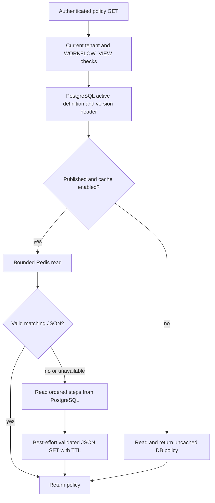

# Published workflow policy cache (M7)

## Business purpose and scope

Published policy reads repeatedly return the same ordered approval steps. Up to 50
steps belong to one immutable version. Redis avoids that repeated ordered-step
hydration after a successful authorized read. It is deliberately a narrow
optimization, not evidence that the entire API or product needs a distributed cache.
No production speedup/capacity claim is made.

Only `GET /api/v1/organizations/{org}/workflows/{definition}/versions/{version}`
uses the cache. Authentication, WORKFLOW_VIEW permission, active organization/
membership, active definition and fresh version header remain PostgreSQL checks.
A hit omits the ordered step query, not all SQL. Reads retain REPEATABLE_READ.
Drafts bypass Redis. Submit/approve/reject/reassign/withdraw/edit/publish commands
use PostgreSQL and never read the display cache. Request search/inboxes, sessions,
roles, grants, quotas and auth rate-limit buckets remain database-backed.

## Cache contract

| Item | Contract |
| --- | --- |
| Key | `gateflow:workflow-policy:v1:{organizationUuid}:{definitionUuid}:{versionUuid}` |
| Value | Typed JSON envelope: schema=1, organizationId, published VersionView |
| TTL | Default 10 minutes; positive random jitter 0–10%, capped at 60 seconds |
| TTL refresh | Only on fill, not on hit; atomically SET value with expiry |
| Max value | 65,536 UTF-8 bytes, configurable 1,024–65,536 |
| Eviction | Dedicated Compose Redis, 128 MiB, allkeys-lru (approximate LRU) |
| Persistence | RDB/AOF disabled; data is reconstructible, no cache volume |
| Negative cache | None; missing/draft/unauthorized results are never cached |
| Enable | Explicit PUBLISHED_POLICY_CACHE_ENABLED; defaults false; dev launcher defaults true |

The local instance is cache-only. Do not share an evictable allkeys-lru instance
with durable queues, sessions, counters whose loss grants access, or distributed
locks. Those need their own reliability contracts and may require separate instances.

## Cache-aside flow

Schema, tenant, version/definition identity, publication timestamp, ordinal/revision,
step bounds/order/IDs, Bean Validation and condition rules are checked against the
fresh header. Unknown/duplicate fields, trailing input, bad enums, fractional integer
fields, depth/number/string limits and oversized bytes are rejected. No Java/native
object deserialization or polymorphic type activation.

A one-key Lua script checks TYPE/STRLEN before GET; wrong-type/oversized entries are
UNLINKed without transferring the payload. Async freeing avoids synchronous deletion
of a large wrong-type aggregate. Redis commands use client timeout bounds. These settings are not an end-to-end
HTTP latency SLA: DNS, TLS handshakes, reconnect scheduling and DB fallback can
add time. Production latency and recovery need ingress deadlines and measurement.
Malformed small JSON is UNLINKed by the reader and rebuilt. Unsupported legacy shapes
remain DB-backed; encoder validation skips caching them rather than repeating an
invalid fill. The source API behavior is not weakened to satisfy a cache validator.

## Invalidation and publication

Published versions and their steps are immutable in PostgreSQL. A policy change
creates a new version UUID/key; the old version remains available for pinned requests
and authorized historical reads. There is no mutable `latest` key and no publish-time
warmup. Only committed published versions observed by subsequent GETs can be filled.
A failed/rolled-back publication cannot create a cache entry.

Archived definitions fail the fresh DB gate, even if the old key still exists.
Permission revocation/suspension is checked before Redis, every time. In-flight
REPEATABLE_READ requests can finish on a pre-revocation snapshot, as before.
TTL and eviction reclaim unused old keys. Administrative repair of immutable data
requires operator-reviewed targeted UNLINK or a namespace/schema bump. `RedisPolicyCache.evict`
handles corrupt values; there is no public clear-cache endpoint or broad FLUSHALL.

## Failure behavior

- Default Redis connect timeout 200 ms, command timeout 250 ms, no application retry.
- Lettuce rejects commands while disconnected rather than accumulating an offline
  replay queue. Per-connection request queue is capped at 256; the options customizer
  preserves the configured connection/command durations. Reconnection stays enabled.
- On Redis DataAccessException, return a miss and fall back to PostgreSQL. Failed
  cache writes/invalidation do not fail an otherwise valid read.
- A monotonic per-process cooldown (default 5 seconds) suppresses further cache I/O
  and warning spam after failure. After cooldown, ordinary traffic attempts recovery.
  This is a simple backoff, not a single-probe distributed circuit breaker: concurrent
  requests already in flight or arriving together after cooldown can all attempt I/O.
- If PostgreSQL cannot authorize/read the header, fail as before (503), even if Redis
  has a value. Cache fallback never means authorization fail-open.
- DB fallback increases load; the small JDBC pool and existing API bounds are not
  proof of overload resilience. Disable the feature during incidents if needed.
- Cache-hit/miss/fallback metrics and traces are deferred to M15; one sanitized
  `workflow_cache_unavailable action=database_fallback cause=<class>` warning is
  emitted per cooldown, without keys, values or exception messages.

## Concurrency and trust

Simultaneous cold reads may hydrate the same committed immutable policy more than
once. Atomic SET+TTL means every winner stores a complete valid value. No distributed
lock/singleflight map is needed for correctness, and no miss deduplication guarantee
is claimed. Measure hot-key/fallback pressure before adding stampede coordination.

Redis is a trusted private infrastructure component, not a cryptographic authority.
Envelope checks detect malformed/scope/revision corruption; they cannot prove every
step name/role was authored by PostgreSQL if an attacker forges a structurally valid
value. A poisoned display value may affect policy presentation, but cannot change
execution: all approval commands read PostgreSQL. Protect Redis with network
isolation, authentication, dedicated ACLs and TLS on managed deployments; treat a
cache compromise as a security incident, not merely a miss. JSON is not signed.

## Configuration and operations

Application env: REDIS_HOST (127.0.0.1), REDIS_PORT (6379), REDIS_USERNAME (empty),
REDIS_PASSWORD (empty unless configured), REDIS_SSL (false), REDIS_CONNECT_TIMEOUT
(200ms), REDIS_COMMAND_TIMEOUT (250ms), PUBLISHED_POLICY_CACHE_ENABLED (false),
PUBLISHED_POLICY_CACHE_TTL (PT10M), PUBLISHED_POLICY_CACHE_COOLDOWN (PT5S),
PUBLISHED_POLICY_CACHE_MAX_BYTES (65536). TTL must be 1 second–24 hours before jitter,
cooldown 1 second–1 minute. Invalid cache property bounds fail startup.

Compose uses a private URL-safe password, loopback-only port, unprivileged Redis
user, read-only filesystem, dropped capabilities and tmpfs secret config. Password
is not passed on the Redis server command line. Healthcheck gets authentication
from environment. Resolved Compose/environment output must not be shared.
No TLS is enabled in local Compose; production must explicitly configure it.
Production needs dedicated least-privilege Redis ACLs for PING, connection handshakes,
GET/SET/TYPE/STRLEN/UNLINK and EVAL/EVALSHA/SCRIPT LOAD on this namespace. Local default
user/password is not a completed production ACL review. No general cache admin API.

The tested digest-pinned Redis image is 7.4.11. Application MIT licensing does not
relicense Redis; review upstream 7.4 licensing/commercial distribution and managed
service options before deployment. Comprehensive vulnerability review remains M20.

See [ADR 009](../decisions/009-published-policy-cache.md),
[verification](../verification/milestone-7.md), and [LLD](../architecture/lld.md).
