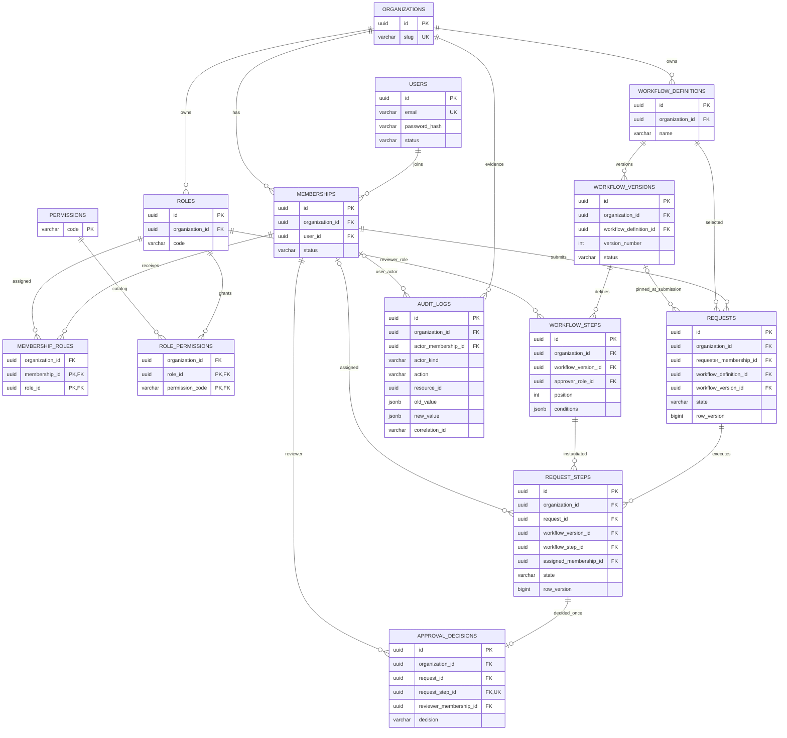

# Core ER diagram

Mermaid renders on GitHub. Every tenant-owned relationship also uses tenant-aware
composite foreign keys; arrows alone do not show all composite key columns.
Draft requests may be unbound until submission. No notification/outbox/auth-session
tables have been introduced early.

The email UK is an expression index on `lower(email)`. Version numbering is unique
per definition, and role codes are unique per organization. Approval cardinality
is intentionally one decision per step for the first sequential engine.
