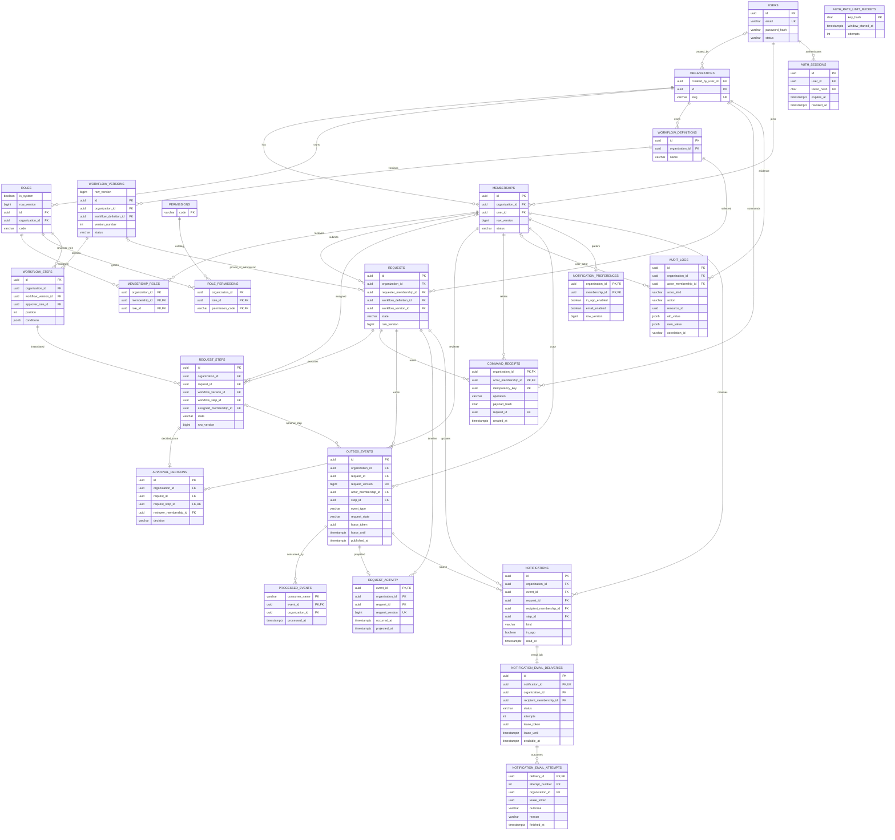

# Core ER diagram

Mermaid renders on GitHub. Every tenant-owned relationship also uses tenant-aware
composite foreign keys; arrows alone do not show all composite key columns.
Draft requests may be unbound until submission. M3 adds global auth-session and
rate-limit storage. M5 adds command receipts; M8 adds outbox, consumer receipts and activity. M9 adds notification preferences/inbox/email delivery/attempts.

The email UK is an expression index on `lower(email)`. Version numbering is unique
per definition, and role codes are unique per organization. Approval cardinality
is intentionally one decision per step for the first sequential engine.

M6 adds a derived `requests.search_document` tsvector and indexes/creation-time guard. No entities or relationships changed; the ER diagram remains structurally correct.
