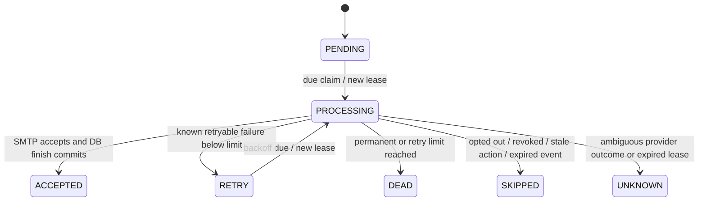

# Notification and email delivery contract

## Product behavior

A requester receives a STATUS_UPDATE for each newly consumed lifecycle event when
still authorized. The currently eligible active assignee also receives ACTION_REQUIRED
only when the source event version equals the current request version. Delayed old
events never alert an outdated reviewer. Targets are bounded to two per event; no
organization-wide broadcast. Reassignment targets the current reviewer, not a cached
role list. Read-model actionability is recomputed from current assignment, required
role, REQUEST_APPROVE and request state; an old card can remain historical but is
not actionable. Inbox list/count/mark-read all enforce recipient ownership plus
fresh tenant/resource visibility, including suspension, disabled accounts and revocation.

Defaults are in-app on, email off. Preferences are self-service per membership/org,
not global across tenants; admin privileges do not expose other recipients' inboxes.
Changes require CSRF and optimistic expectedVersion. They commit with an immutable
NOTIFICATION_PREFERENCES_CHANGED audit containing only channel booleans/version and
request ID. Stale writes return 409; an audit failure rolls back preferences.

Preferences at projection time determine which notification/channel rows to create.
Both channels off => no rows, but the event's successful consumer receipt is retained.
Email-only => provenance row hidden from the in-app inbox. Turning in-app off affects
future creation, not existing history. Turning email off cancels unsent work at its
next preflight check; turning it back on does not replay skipped/dead history.

## Two independent subscribers

The domain exchange fans out original request references to activity and notification
queues. The new notification queue has its own receipt name notification_projection_v1,
retry/work/dead exchanges and three delayed quorum retry queues. Retry TTLs come from
the existing validated async settings (5s/30s/120s default); four processing attempts
maximum. Retry return goes only to notifications.work.v1 / notification, not back to
the shared domain exchange. Queues are durable, bounded quorum queues with reject-publish
and at-least-once dead lettering. This reuses the strict, tested reference handler
rather than duplicating ACK/failure code. Activity remains independent and its M8
public listener/test contract is preserved.

The projector transaction atomically commits a unique consumer receipt, recipient
notification rows and any email jobs. It shares the organization lock to coordinate
RBAC writers, rechecks eligibility and preferences, and does no SMTP I/O. Duplicate
or concurrently repeated events cannot create duplicate recipient rows/email jobs.
Any insert failure rolls back all projection effects before broker retry. Approval
state itself was already committed and is not rolled back by notification failures.

Provision durable queues/bindings **before** allowing relays to publish with an
expectation of notification coverage. A publisher confirm means broker acceptance,
not that every intended subscriber binding existed. If the notification binding is
missing while activity is still bound, the source can be marked published without
notification delivery. Restricted configure permissions and topology health checks
are production responsibilities. No retrospective backfill of pre-M9 published
events is performed. New independent subscribers are not a retained replay stream.

## Durable email queue and state machine

The Rabbit worker creates an email-delivery job in PostgreSQL; the scheduled email
worker claims it with SKIP LOCKED and a UUID fencing token in a short transaction.
SMTP runs outside database locks/transactions. Only known safe pre-acceptance failures
retry. There is no second broker queue or best-effort provider call inside a projection.

Each completed attempt and its sanitized reason is inserted atomically with the
fenced status update. Attempt history is append-only; terminal delivery records and
notification provenance are protected from ordinary UPDATE/DELETE/TRUNCATE. Inbox
rows permit only the first read_at acknowledgment; repeated reads are idempotent.
Unique notification_id prevents duplicate email jobs. Terminal UNKNOWN/DEAD is a
durable review queue, not a Rabbit DLQ. Notification-generation poison/exhaustion
uses the separate Rabbit notification DLQ.

Defaults: five email attempts, five jobs per poll, poll every second, 60-second
lease, capped exponential retry 10s to 5m plus positive jitter, source age limit 48h.
A stale ACTION_REQUIRED email is skipped after a reviewer/state change; outdated
status emails older than max-age are skipped as EXPIRED. Claims/lease expiry use
PostgreSQL time. Processing a job does not hold its DB transaction during SMTP.
The reaper moves up to 100 expired leases to UNKNOWN with matching immutable
attempt outcomes; stale workers cannot overwrite terminal results with old tokens.

## SMTP ambiguity: the important failure window

EmailSender is a provider interface; SmtpEmailSender implements actual Jakarta Mail
SMTP via Spring Mail. SMTP connection refusal and authentication failures are known
pre-acceptance and retryable. Invalid addresses/header injection are permanent.
Other MailException outcomes are conservatively SMTP_UNCERTAIN: timeout after DATA
can mean the server accepted a message whose reply never reached us.

If SMTP accepts but the final DB transaction fails, leave PROCESSING intact. Lease
expiry quarantines UNKNOWN; **do not automatically resend**. Crashing before SMTP
also becomes UNKNOWN because durable state cannot distinguish the two cases. This
trades automatic eventual email recovery for avoiding blind duplicates. In-app
notifications remain available. Neither SMTP acceptance nor Message-ID proves final
mailbox delivery, and a deterministic Message-ID is **not provider idempotency**.
A future provider with a real idempotency/status API can safely improve recovery.

The sender uses one recipient, plain text, fixed subject/body and a stable opaque
Message-ID derived from the delivery UUID. It sends no request title, amount,
organization, resource IDs, actor details or external link. Provider results and
failure reasons never log raw addresses, credentials, SMTP exception strings or
business payloads; adapter failure codes are explicitly whitelisted. Eligibility
and email address are freshly read before transport. Revocation racing a network
send cannot retract an accepted email; generic content minimizes that residual risk.
No fake success/no-op email provider is used.

## Configuration and security

Outside the dev launcher, NOTIFICATIONS_ENABLED=false and EMAIL_ENABLED=false.
In-app APIs/preferences remain usable; generation requires both ASYNC_ENABLED and
NOTIFICATIONS_ENABLED. NOTIFICATION_CONSUMER_ENABLED can disable the Rabbit worker
independently. EMAIL_WORKER_ENABLED controls SMTP scheduling; an email-disabled
worker never claims/sends jobs. Email jobs may accumulate while transport is disabled,
then current preferences/access/action/age are rechecked when it resumes. API instances
and dedicated background processes can use role flags from the same modular artifact.
No microservice split is required.

SMTP_HOST/PORT/USERNAME/PASSWORD, SMTP_AUTH, SMTP_STARTTLS and SMTP_STARTTLS_REQUIRED
configure the real adapter; EMAIL_FROM must be a valid address. SMTP per-operation
timeouts: connect 1s/read 2s/write 2s. Required STARTTLS defaults true outside dev;
production must explicitly enable auth and configure secrets/network/provider policy.
Per-operation limits do not prove a strict end-to-end send SLO under slow trickle
responses; expired leases are quarantined rather than aggressively reclaimed.

The development launcher points only to Compose Mailpit, enables notification/email
workers, and disables TLS/auth only for that loopback capture sink. Email remains
user opt-in. Mailpit captures locally, never relays externally; no real recipient
mailbox was contacted during verification. SMTP and HTTP/API host ports are loopback
only. Digest-pinned Mailpit 1.31.3 runs as UID/GID 1000, read-only root, dropped
capabilities, no-new-privileges, ephemeral 64-MiB tmpfs capture DB, 300 message cap,
1-MiB message limit, no version-check/SMTP reverse-DNS calls. Captured test messages
are not application delivery state and need no persistent production volume.

Existing signup does not yet verify ownership of an email address. **Do not enable
external production email until verification/abuse controls and provider/domain
configuration are implemented.** There is no public recipient override, provider
send endpoint, HTML template input or live-provider integration in this milestone.

## Recovery and operations

1. Check source DB, outbox age, notification queue/retry/DLQ depths and recipient
   projection progress. Restore missing topology before expecting new events.
2. Generation DLQ can be redriven using the original valid reference to
   notifications.work.v1 / notification, persistent message, same messageId,
   x-gf-attempt=0 and publisher confirms. ACK the DLQ original only after acceptance.
   Receipts safely deduplicate previous successful projections; never reset receipts.
3. For RETRY, fix SMTP connectivity/auth and allow bounded automatic retry. For
   SKIPPED, inspect the safe reason code; reenabling a preference does not replay
   previously skipped mail.
4. For DEAD/UNKNOWN, correlate delivery ID/Message-ID with provider records and
   reconcile manually. Never blindly clear a lease, flip terminal status, delete
   attempt history or reset a notification job. SMTP has no reliable accepted-status
   query in this implementation. No public terminal replay/reconciliation endpoint
   exists; a future audited maintenance operation requires explicit outcome evidence.
5. Monitor pending/due/expired leases, UNKNOWN/DEAD counts, attempts and oldest job
   age. Full metrics/alerts/health and admin tooling are M15/later security operations,
   not silently implemented here. Retention, per-tenant fairness/quotas and verified
   addresses remain production prerequisites. Local single-node RabbitMQ is not HA.

## Design/algorithm choices

EmailSender + dependency injection isolates provider mechanics without an invented
factory for a single adapter. SQL repositories own leases and constraints; services
own policies and transaction boundaries. Unique B-tree receipt/job indexes make
competing dedup/claims durable across processes. SKIP LOCKED avoids serializing all
workers behind one busy row. Positive exponential jitter avoids identical retry
schedules; its capped shift is O(1) time/space. Candidate index work is typically
O(log N + visited rows), not constant-time when many rows are locked. Fanout is at
most two; no unbounded audience scan. Inbox filtering shares authoritative request
visibility in one SQL query, not per-item application authorization calls.
